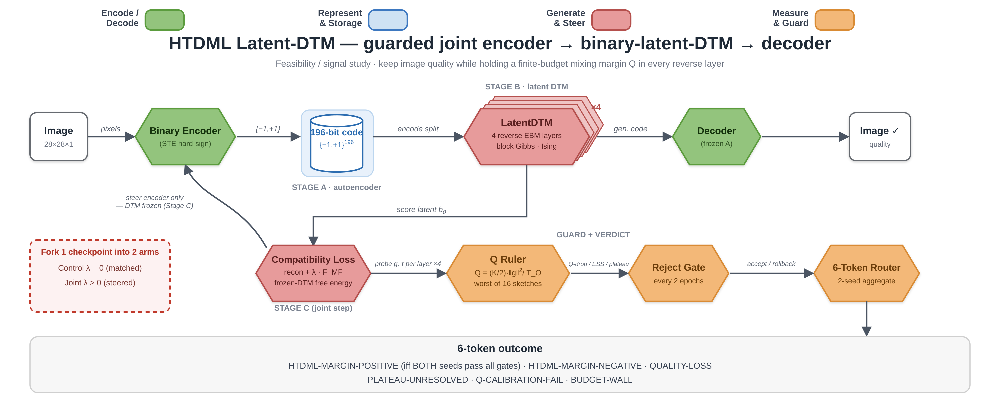
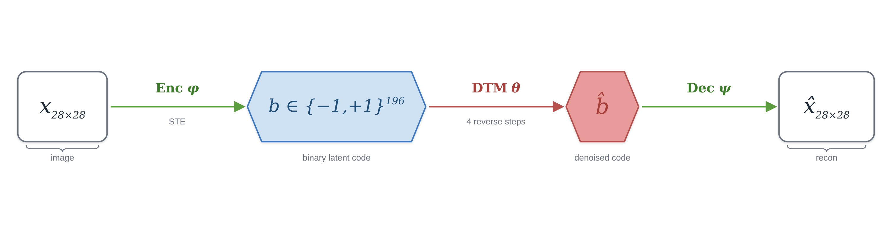
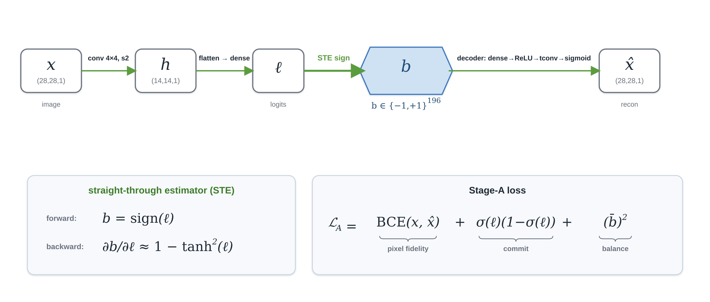
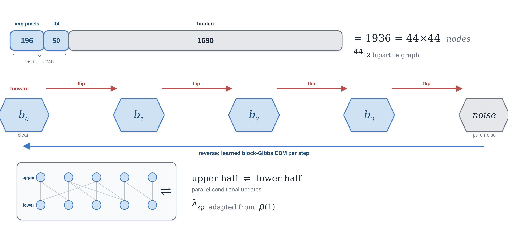
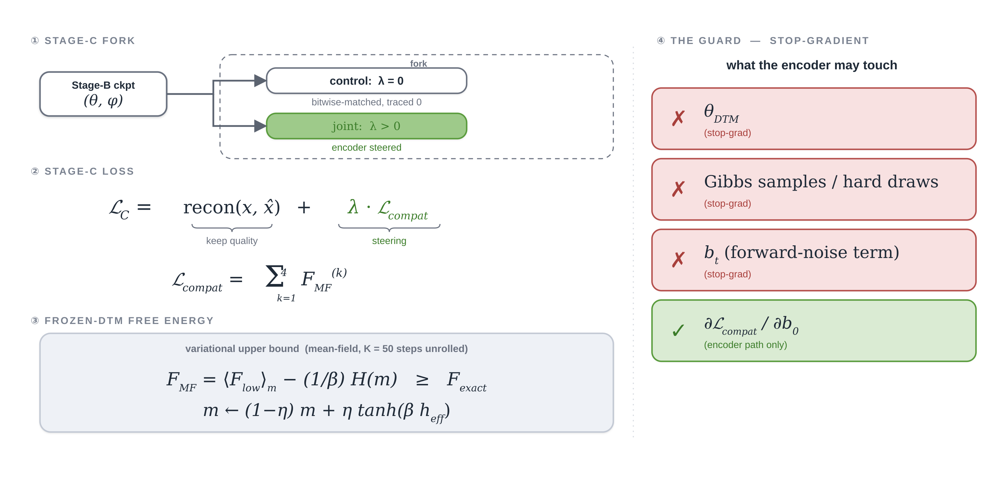
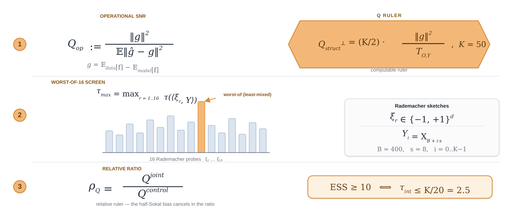
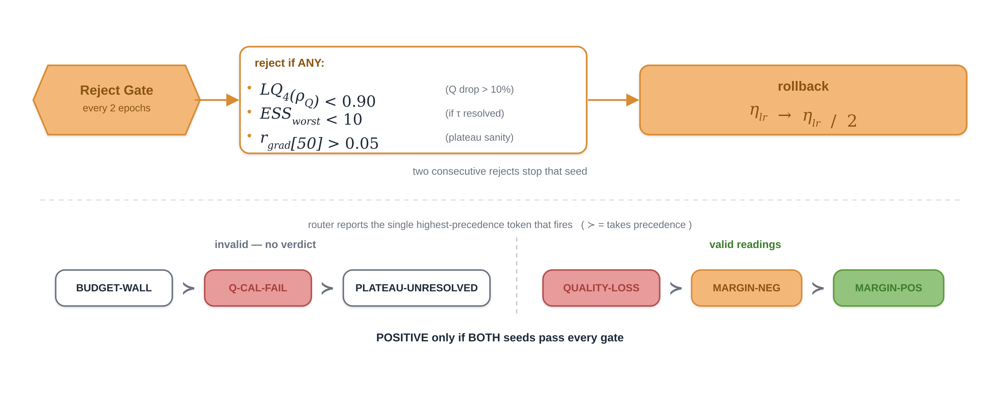
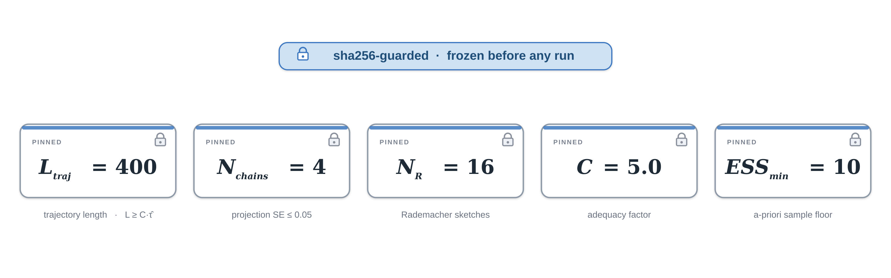
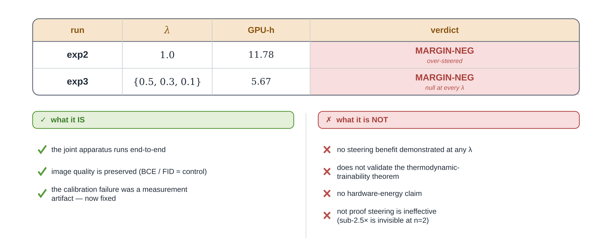

# Joint-training a latent discrete-diffusion EBM, made mixing-aware — an honest null

<p align="center">
  
</p>

<p align="center">
  <a href="https://arxiv.org/abs/2510.23972"></a>
  <a href="https://wandb.ai/sana-xr0001-personal/Htdml"></a>
  
  
</p>

> *The DTM paper flagged joint encoder→DTM→decoder training as an open problem. We built a guarded, mixing-aware version, put a measurement ruler on the sampler, and report exactly what it did — and didn't — buy. Spoiler: quality held; the mixing margin never improved (and at full strength it degraded); the durable result is about measurement, not acceleration.*

---

## Contents

- [1 · The gap this fills](#1--the-gap-this-fills)
- [2 · Stage A — a hard binary code](#2--stage-a--a-hard-binary-code)
- [3 · Stage B — the 4-layer reverse EBM](#3--stage-b--the-4-layer-reverse-ebm)
- [4 · Stage C — the guarded joint step](#4--stage-c--the-guarded-joint-step)
- [5 · The Q ruler](#5--the-q-ruler-a-guard-never-theorem-validation)
- [6 · The reject gate + the 6-token router](#6--the-reject-gate--the-6-token-router)
- [7 · The Frozen-Five](#7--the-frozen-five-pinned-sha256-guarded)
- [8 · What we actually found](#8--what-we-actually-found-the-honest-part)
- [9 · Reproducibility & links](#9--reproducibility--links)
- Appendix: [Repository layout](#repository-layout) · [6-token vocabulary](#the-6-token-outcome-vocabulary) · [Running it](#running-it) · [Citation](#citation)

---

## 1 · The gap this fills

Denoising Thermodynamic Models (DTM; Jelinčič et al. 2025, [arXiv:2510.23972](https://arxiv.org/abs/2510.23972)) learn to generate by running a short reverse chain of energy-based models sampled on thermodynamic hardware. Their latent-image variant embedded pixels into a binary code, then trained the autoencoder and the DTM **separately** — which they call out themselves as "a major flaw … not jointly trained … a promising future research direction." Joint training of encoder → binary-latent-DTM → decoder is therefore **their own named open problem**. This companion is a scoped, guarded attempt at exactly that step — and makes it mixing-aware (it steers with a frozen-DTM free-energy loss, not a GAN decoder).

The whole pipeline, end to end:

<p align="center">
  
</p>

## 2 · Stage A — a hard binary code

An Ising EBM needs discrete spins, so Stage A learns a spatial autoencoder whose bottleneck is a hard {−1,+1}¹⁹⁶ code. A straight-through estimator (STE) makes the discrete bottleneck differentiable: the forward pass is sign(·); the backward pass uses a smooth surrogate.

<p align="center">
  
</p>

The decoder mirrors the encoder (dense → ReLU → transpose-conv → sigmoid). Only the forward pass is discrete — that is what turns the generator into an Ising model.

## 3 · Stage B — the 4-layer reverse EBM

Freeze the encoder, encode the whole split once, and train a discrete-diffusion EBM over the frozen 246-bit visible code (196 image + 50 label) on a 44_12 bipartite graph:

<p align="center">
  
</p>

The forward (noising) process is fixed and defines the target; the reverse (denoising) process is a cascade of 4 time-indexed Ising EBMs whose node/edge weights are learned.

Each reverse layer denoises by block Gibbs on the bipartite grid, with mixing kept healthy by the Adaptive Correlation Penalty (ACP), which watches chain autocorrelation and adapts its penalty.

Sampling budget per chain: **400** warmup sweeps, then **50** samples every **8** sweeps.

## 4 · Stage C — the guarded joint step

This is the paper's open problem. Fork the one Stage-B checkpoint into two arms that share everything but the steering strength λ, and alternately update **only the encoder**:

<p align="center">
  0); update only the encoder under a frozen-DTM free-energy compatibility loss" width="820">
</p>

The steering signal is a frozen-DTM free-energy surrogate per reverse step (hidden nodes marginalized): the lower hidden layer has a closed-form (Poisson-binomial cosh) marginal; the upper hidden layer uses a damped mean-field unroll. It is a variational upper bound on the true free energy.

The "guard" is what is held under stop-gradient — the encoder can never cheat by editing the DTM or backprop-ing through sampling.

## 5 · The Q ruler (a guard, never theorem validation)

To ask whether steering preserves the finite-budget mixing margin, each arm is measured per layer with a mixing ruler. The operational quantity is a gradient signal-to-noise ratio; the computable ruler used in practice replaces the estimator MSE with a mixing-time denominator:

<p align="center">
  
</p>

That mixing-time denominator is a half-Sokal estimator on the retained Y-process, screened by 16 fixed Rademacher sketches (worst-of — the least-mixed direction).

Crucially, Q is used **only as a relative ruler** (joint ÷ control); the systematic half-Sokal bias cancels in the ratio. It is never used to validate the wiki's frozen Q_op ≈ Q_struct^⊥ theorem.

## 6 · The reject gate + the 6-token router

Every 2 joint epochs the candidate encoder faces a per-update reject gate; two consecutive rejects stop that seed:

<p align="center">
  
</p>

Outcomes route through a 6-token ladder (measurement-validity first, then improvement); a run is POSITIVE only if **both** seeds pass every gate.

The first three tokens are invalid (no verdict); the last three are valid readings. A pre-Stage-C calibration gate (double the trajectory length, require T_O doubling-stability) refuses to judge on an unresolved probe.

## 7 · The Frozen-Five (pinned, sha256-guarded)

<p align="center">
  
</p>

C = 5.0 is the trajectory-adequacy factor (L ≥ C·τ̂); N_chains = 4 targets projection standard error ≤ 0.05; ESS_min pins the a-priori sample floor. These were frozen before any run.

## 8 · What we actually found (the honest part)

Two GPU runs, two seeds each:

<p align="center">
  
</p>

**exp2 (λ = 1.0).** A calibration-gate fix (a regime-aware τ floor) let Stage C run for the first time — both seeds passed calibration. But λ = 1.0 over-steered: the reject gate fired Q_drop repeatedly (the joint arm's lower-quartile Q fell below control; it never reached the required ≥1.25×). Image quality was preserved (BCE/FID ≈ control). One seed hit two consecutive rejects and stopped.

**exp3 (λ ∈ {0.5, 0.3, 0.1}).** Negative at every λ. A couple of per-seed τ-leg "passes" appeared — but they are not distinguishable from control-denominator noise: the λ=0 control's worst-layer τ swings ~0.9 → 2.3 for the same seed across identical-code runs, while the steered τ sits flat; the deterministic τ̂ even inverts the seed order. The strongest pro-effect summary (steered avoids metastable stalls 0/6 vs control 2/6) is Fisher p ≈ 0.46 — real but underpowered — and on non-stall layers the steered chain is slower on 5 of 8 (reshuffling, not acceleration).

**The durable finding is about measurement, not acceleration.** A relative ratio cancels systematic bias but not variance: at L_traj = 400 with n = 2 seeds, the worst-layer-max τ ratio is noise-dominated, so per-seed gate passes can't be read as effects. An earlier draft that claimed a "reproducible τ-route mixing improvement" was caught and retracted by a two-round adversarial-verification pass — and that discipline is the point.

**Scope (what this is / isn't).** ✅ The joint apparatus runs end-to-end; ✅ quality is preserved; ✅ the calibration failure was a measurement artifact, now fixed. ❌ No steering benefit was demonstrated at any λ; ❌ this does not validate the thermodynamic-trainability theorem (HTDML only applies the Q ruler as a guard — the wire is one-way); ❌ no hardware-energy claim; ❌ and it is not proof the steering is ineffective — a sub-2.5× effect would be invisible at this sample size. The honest next step is a reliability run (control-variance model, longer trajectories, n > 2), not another effect run.

## 9 · Reproducibility & links

- **W&B project:** [wandb.ai/sana-xr0001-personal/Htdml](https://wandb.ai/sana-xr0001-personal/Htdml) (runs upload pending).
- **Parent result:** the thermodynamic-trainability Q predictor — conditional factorization [solid], operational claim [conjectured]. HTDML is its downstream application companion.
- **Source paper:** Jelinčič et al., *Denoising Thermodynamic Models*, [arXiv:2510.23972](https://arxiv.org/abs/2510.23972).

This was a MEASURE-ONLY companion — the value is a clean, guarded apparatus for the DTM's open problem plus an honest, reusable lesson about ratio-estimator variance.

---

## Repository layout

```text
harness/                  measurement primitives
  probe_primitives.py       half-Sokal τ, ρ_Y, ESS, Q_struct⊥, Rademacher sketches
  reversible_scan.py        reversible negative-phase sampler (HTDML-* patch)
  selfadjoint_cert.py       detailed-balance / self-adjoint certificate
src/htdml/                the guarded pipeline
  autoencoder.py            Stage A — STE hard-binary autoencoder
  latent_dtm.py             Stage B — 4-layer reverse Ising EBM wrapper
  compatibility.py          Stage C — frozen-DTM free-energy steering loss
  trainability_probe.py     per-layer frozen-θ Q probe + doubling calibration
  driver.py                 Stage A/B/C driver + reject gate + 6-token router
  orchestrator.py           2-seed run assembly + budget wall
scripts/
  run_stage_c.py            the only GPU-touching entry point
  dataset_gate.py           offline Fashion-MNIST + FID-weights gate (no network)
  smoke.py, calib_logic.py  CPU smoke + calibration-cost helpers
tests/                    full suite incl. the zero_compute_checks.py battery
vendor/                   read-only pinned deps (dtm-replication, thrml overlay)
experiments/              exp1 / exp2 / exp3 pre-registration + artifacts
PINS.md                   frozen constants + dataset / FID sha256
```

## The 6-token outcome vocabulary

Results are expressed using exactly these companion-local tokens:

| Token | Meaning |
|-------|---------|
| `HTDML-MARGIN-POSITIVE` | Joint training retains image quality **and** the mixing margin across all gates |
| `HTDML-MARGIN-NEGATIVE` | Mixing-margin gate fails (finite-budget probe below the ESS_min threshold) |
| `QUALITY-LOSS` | FID gate fails (decoded image quality drops below the acceptable threshold) |
| `PLATEAU-UNRESOLVED` | Trajectory too short to certify autocorrelation (L_traj < C·τ̂) |
| `Q-CALIBRATION-FAIL` | Probe calibration gate fails (gradient-SNR estimate not well-defined) |
| `BUDGET-WALL` | Compute budget exceeded before any gate is cleared |

**Two-seed rule:** the overall result is `HTDML-MARGIN-POSITIVE` **iff** both seeds pass all final gates independently; any failure in either seed yields the corresponding negative token.

## Running it

```bash
# conda base python
python -m pytest tests/ -q     # full suite, incl. the zero-compute battery
```

`scripts/run_stage_c.py` is the only GPU-touching entry point; the pure run logic lives in `src/htdml/orchestrator.py`. Frozen constants and pinned input checksums live in `PINS.md`; changing any of the Frozen-Five requires updating the corresponding sha256 in `tests/test_isolation.py`.

## Citation

```bibtex
@software{htdml_latent_dtm_2026,
  title  = {HTDML Latent-DTM: a guarded, mixing-aware joint encoder-to-binary-latent-DTM-to-decoder},
  author = {sanaxr0001-tech},
  year   = {2026},
  url    = {https://github.com/sanaxr0001-tech/HTDML-Latent-DTM-Experiments}
}
```

Source paper — Jelinčič et al., *Denoising Thermodynamic Models*, arXiv:[2510.23972](https://arxiv.org/abs/2510.23972).

---

<sub>Measure-only feasibility study. Figures are diagrammatic. Outcome tokens are companion-local, not claim-status tags.</sub>
